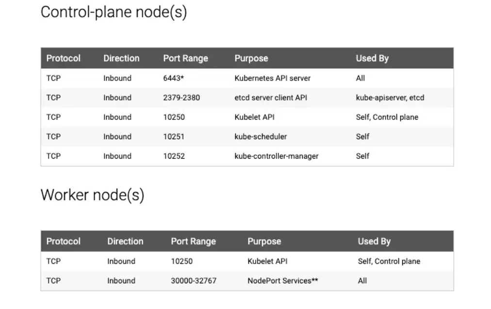

<<<<<<< HEAD

Kubeadm Cluster Prerequisites
We will use a kubeadm-based cluster setup

VM Prerequisites
Following are the prerequisites for Kubeadm Kubernetes cluster setup.

- Minimum two Ubuntu nodes (24.04) [One master and one worker node]. 
- The master node should have a minimum of 2 vCPU and 2GB RAM.
- For the worker nodes, a minimum of 1vCPU and 2 GB RAM is recommended.

Firewall Requirements
- Allow all traffic for communication between nodes (All TCP and UDP traffic).
- From your workstation, open port 6443 and the port range 30000-32767 to enable API server and NodePort access via Public IP addressess.
- Also, allow all traffic between nodes from the pod CIDR 10.244.0.0/16, which will be used to configure the clusters. This enables you to connect to ClusterIP services from within the nodes.

The following image shows the port requirements for the clusters.

>>>>>>> 18fd35e (First commit)

Provision underlying infrastructure to deploy a Kubernetes cluster
In this section, we will set up the essential utilities and services required to run a Kubernetes cluster.

- CRI-O Container Runtime: We use CRI-O and you will need to use crictl commands for troubleshooting scenarios.
- Kubeadm: Utility that bootstraps the cluster following Kubernetes' recommended best practices.
- Kubelet: A systemd service that runs on all nodes to manage container lifecycle.
- kubectl: A command-line tool for interacting with the Kubernetes cluster.

Important Note: The following steps must be performed on all nodes (both control plane and worker nodes).